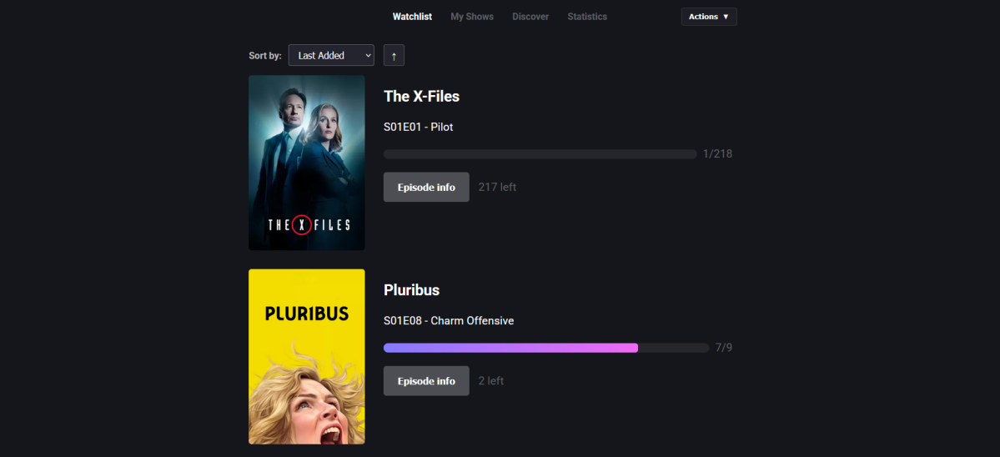

# NextUp - Smart Show Tracker



## Project Description

NextUp is a modern **TV show tracker** built with Vanilla JavaScript and Supabase. Track your watched episodes, explore shows, review seasons, and get detailed statistics — all in a **single-page application**. Optionally, link your Trakt.tv account to import existing shows and sync progress.

## Features

- **Watchlist / My Shows**: Browse your collection, sort by next episode, mark watched/unwatched.
- **Discover & Add Shows**: Search shows, explore new releases, add them to your collection.
- **Statistics Dashboard**: Visual overview of watched episodes, total watch time, top genres, and top shows.
- **Show Details & Episodes**: Episode modals with air dates, screenshots, and watch toggles.
- **Persistent Data**: Supabase handles all user-specific data with secure Row-Level Security (RLS).
- **Trakt.tv Sync**: Optionally link your Trakt account to import existing shows and sync progress.

## Tech Stack

- **Frontend**: HTML5, CSS3, Vanilla JavaScript (ES6 modules), Single Page Application
- **Backend / Database**: Netlify Functions, Supabase
- **APIs**: Trakt.tv (show & episode data)
- **Deployment**: Netlify / Vercel-ready

  [](https://skillicons.dev)

## Quick Start

1. **Clone the repository**

   ```bash
   git clone git@github.com:AntonioSertic23/NextUp.git
   ```

2. **Set up environment variables**

   Create a `.env` file with your Trakt and Supabase credentials:

   ```sh
   TRAKT_CLIENT_ID="your_trakt_client_id_here"
   SUPABASE_URL="your_supabase_url"
   SUPABASE_ANON_KEY="your_supabase_anon_key"
   SUPABASE_SERVICE_ROLE_KEY="your_supabase_service_role_key"
   ```

3. **Install dependencies**

   ```bash
   npm install
   npm install -g netlify-cli
   ```

4. **Run locally**

   ```bash
   netlify dev
   ```

5. **Open** the displayed localhost URL in your browser.

## Usage Overview

- **Watchlist / My Shows**: Browse your collection, sort by next episode, mark watched/unwatched.
- **Discover & Add Shows**: Search shows, explore new releases, add them to your collection.
- **Statistics Dashboard**: Visual overview of watched episodes, total watch time, top genres, and top shows.
- **Show Details & Episodes**: Episode modals with air dates, screenshots, and watch toggles.
- **Persistent Data**: Supabase handles all user-specific data securely.
- **Trakt.tv Sync**: Optional import of shows and progress from Trakt.tv; syncing is **explicitly triggered** by the user.

## Security & Privacy

- User authentication is handled via **Supabase Auth**; no passwords or sensitive PII are ever stored externally.
- Supabase RLS guarantees **user-specific data isolation**.
- All backend logic is **serverless and transparent**.
- Trakt sync is optional and **explicitly triggered**; it only imports show data and progress.

## Author

**Antonio Sertić**

## License

MIT License
