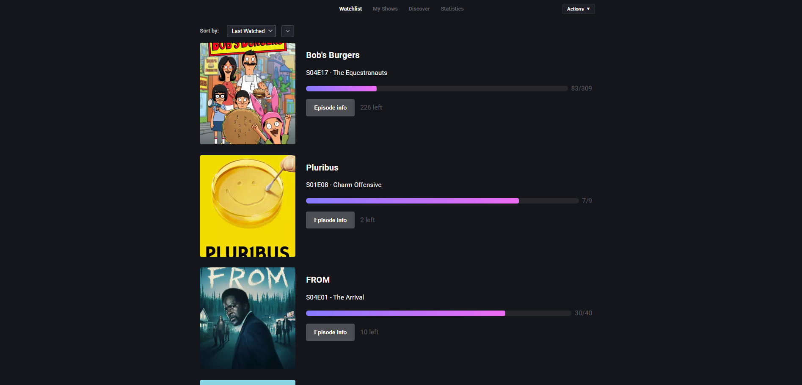
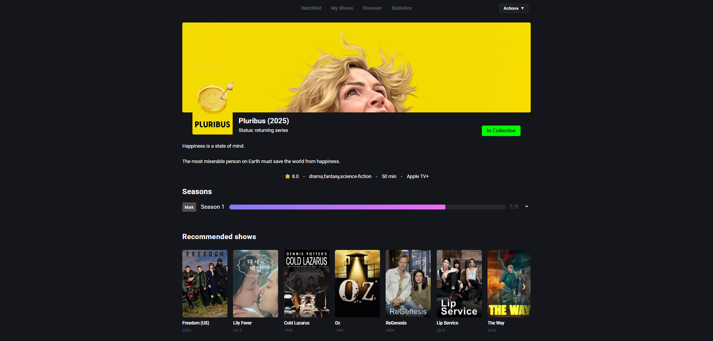
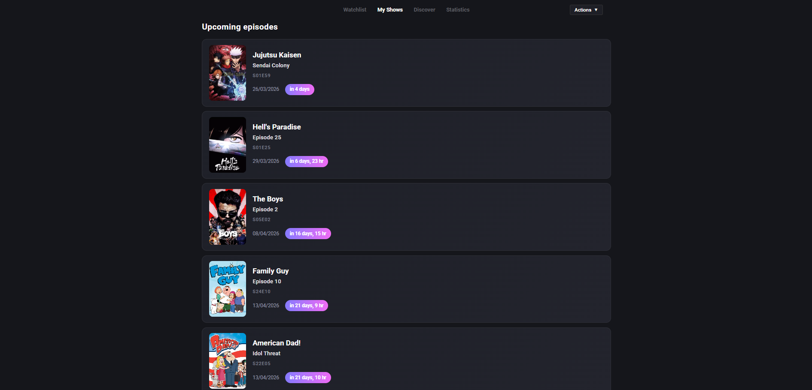
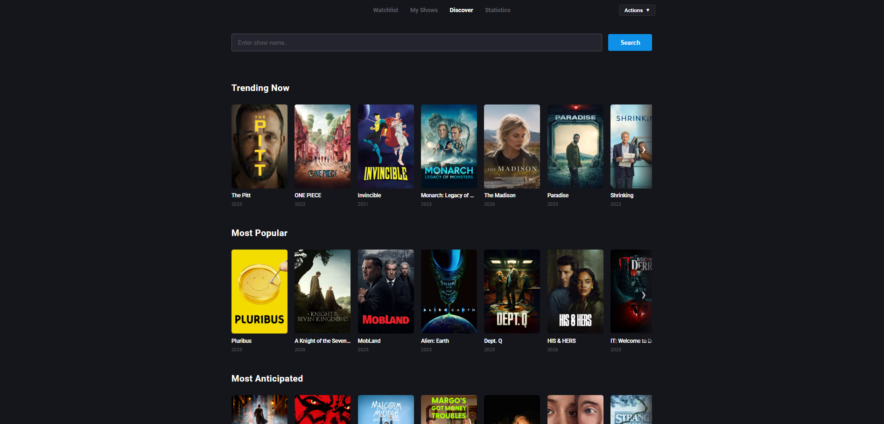
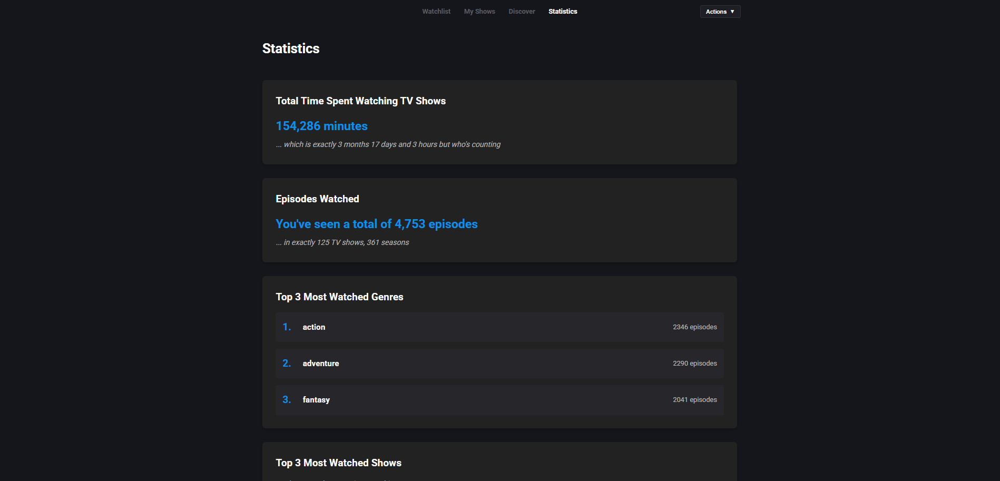

# NextUp - Smart Show Tracker

<p align="center">
  
  
  
</p>
<p align="center">
  
  
</p>

## Project Description

NextUp is a modern **TV show tracker** built with Vanilla JavaScript and Supabase. Track your watched episodes, explore shows, review seasons, and get detailed statistics — all in a **single-page application**. Optionally, link your Trakt.tv account to import existing shows and sync progress.

## Features

- **Home watchlist**: Your default list on the home page with **sorting** (last added, title, year, rating, last watched, episodes left) and **ascending/descending** order — preferences persist in the browser (`localStorage`).
- **My Shows**: **Upcoming episodes** (future air dates) with show title, episode title, season/episode code, air date, and a **countdown**; **all shows in your list** in a poster grid with **title and year**. Section **headings** separate the two blocks.
- **Discover**: **Search** with pagination plus Trakt **Trending**, **Popular**, and **Most Anticipated** rows below the search bar (horizontal carousels).
- **Show page**: Full details, seasons/episodes, and **Recommended shows** (Trakt related) under the seasons — grid or carousel depending on how many results are returned.
- **Statistics Dashboard**: Visual overview of watched episodes, total watch time, top genres, and top shows.
- **Episode experience**: Modals with air dates, screenshots, and watch toggles.
- **Persistent Data**: Supabase handles all user-specific data with secure Row-Level Security (RLS).
- **Trakt.tv Sync**: Optionally link your Trakt account to import existing shows and sync progress.
- **Automatic Episode Sync**: A weekly scheduled function checks for new episodes across all tracked shows and updates the database automatically (seasons, episodes, and user progress).
- **Secure Token Management**: Trakt OAuth uses the authorization code flow with automatic token refresh — no manual re-authentication needed.

## Tech Stack

- **Frontend**: HTML5, CSS3, Vanilla JavaScript (ES6 modules), Single Page Application
- **Backend / Database**: Netlify Functions, Supabase
- **APIs**: Trakt.tv (show & episode data)
- **Deployment**: Netlify / Vercel-ready

  [](https://skillicons.dev)

## Project Architecture

```
NextUp/
├── index.html                          # Main SPA shell
├── login.html                          # Login / registration page
├── netlify.toml                        # Netlify build & function config
├── package.json
├── .env                                # Environment variables (not committed)
│
├── css/
│   └── style.css                       # Global styles
│
├── components/                         # Reusable HTML fragments loaded at runtime
│   ├── header.html                     # Navbar, dropdown actions
│   └── footer.html
│
├── db/
│   └── migration.sql                   # Supabase schema & seed (tables, RLS, triggers)
│
├── src/                                # Client-side JavaScript (ES modules)
│   ├── app.js                          # Entry point: auth check, hash router, component loader
│   ├── login.js                        # Login / register form logic
│   │
│   ├── api/                            # Server communication layer (one file per domain)
│   │   ├── shows.js                    #   getShowDetails, searchShows, getTraktShows, getRelatedShows, manageCollection
│   │   ├── episodes.js                 #   markEpisodes
│   │   ├── watchlist.js                #   getWatchlistData, getShowNextEpisode, upcoming & collection queries
│   │   ├── stats.js                    #   getStatsData (aggregates + calculations)
│   │   └── sync.js                     #   Trakt OAuth redirect, connect, syncTraktAccount
│   │
│   ├── ui/                             # DOM rendering (one file per page section / concern)
│   │   ├── navigation.js              #   updateActiveNav
│   │   ├── watchlist.js               #   renderWatchlist, renderSortControls
│   │   ├── showDetails.js            #   renderShowDetails, seasons, recommended shows (Trakt related)
│   │   ├── discover.js               #   search, pagination, trending/popular/anticipated carousels
│   │   ├── myShows.js                #   renderUpcomingEpisodes, renderAllCollectionShows
│   │   ├── statistics.js             #   renderStatistics
│   │   └── episodeModal.js           #   Episode info modal, mark/unmark, shared UI helpers
│   │
│   ├── pages/                          # Page renderers (called by the router)
│   │   ├── home.js                     #   Watchlist page
│   │   ├── show.js                     #   Single show details page
│   │   ├── discover.js                 #   Search / discover page
│   │   ├── myShows.js                  #   Upcoming episodes + full collection
│   │   └── stats.js                    #   Statistics dashboard
│   │
│   ├── stores/                         # Client-side state management (in-memory singletons)
│   │   ├── userStore.js                #   Authenticated user, session, claims
│   │   ├── watchlistStore.js           #   Watchlist items, sort/order state
│   │   ├── myShowsStore.js             #   Upcoming episodes + collection cache
│   │   ├── discoverStore.js            #   Search query, results, pagination
│   │   └── statsStore.js               #   Computed statistics cache
│   │
│   ├── services/                       # Client-side infrastructure
│   │   ├── auth.js                     #   login, register, logout, getToken (Trakt token from DB)
│   │   └── supabase.js                 #   Supabase client singleton (lazy-initialized from config endpoint)
│   │
│   └── utils/                          # Pure helper functions (no side effects)
│       ├── format.js                   #   formatDate, formatEpisodeInfo, getTimeUntil
│       └── stats.js                    #   calculateStatistics, convertMinutesToTime, formatTimeBreakdown
│
└── netlify/
    ├── lib/                            # Shared server-side libraries
    │   ├── supabase.js                 #   Supabase admin client, DB helpers (saveShow, saveEpisodes, etc.)
    │   └── trakt.js                    #   Trakt API config, headers, OAuth token exchange/refresh
    │
    └── functions/                      # Serverless API endpoints (flat — Netlify requirement)
        ├── getClientId.js              #   Returns Trakt client ID to the browser
        ├── getSupabaseConfig.js        #   Returns Supabase URL + anon key
        ├── traktAuth.js                #   Exchanges Trakt auth code for tokens
        ├── syncTraktAccount.js         #   Full Trakt → DB sync (shows, episodes, progress)
        ├── syncNextEpisodes.js         #   Scheduled: weekly check for new episodes
        ├── getShowDetails.js           #   Fetch or cache show with seasons/episodes
        ├── searchShows.js              #   Trakt show search with pagination
        ├── getTraktShows.js            #   Trakt trending / popular / anticipated lists
        ├── getRelatedShows.js          #   Trakt related shows for a given show
        ├── getNextEpisodes.js          #   Next episode data for multiple shows
        ├── getEpisodeDetails.js        #   Single episode details from Trakt
        ├── getWatchlistData.js         #   Watchlist query (Supabase)
        ├── markEpisodes.js             #   Mark/unmark watched + Trakt sync
        └── manageCollection.js         #   Add/remove show from user's list
```

### How the layers connect

```
Browser
  │
  ├─ index.html ──► src/app.js (router)
  │                   ├─ src/pages/*        ← page renderers
  │                   │    ├─ src/api/*     ← data fetching (calls Netlify Functions or Supabase directly)
  │                   │    └─ src/ui/*      ← DOM rendering
  │                   ├─ src/stores/*       ← in-memory state
  │                   ├─ src/services/*     ← auth & Supabase client
  │                   └─ src/utils/*        ← pure helpers
  │
  ├─ /.netlify/functions/* ◄── HTTP calls from src/api/
  │     └─ netlify/lib/*       ← shared server-side Supabase + Trakt logic
  │
  └─ Supabase (PostgreSQL + Auth + RLS)
```

**Data flow**: Pages call **api/** modules, which either query Supabase directly (for list/watchlist data) or call **Netlify Functions** (for Trakt-dependent operations). Functions use shared **lib/** modules for database writes and Trakt API communication.

**State flow**: Pages read from and write to **stores/** (in-memory singletons). **UI/** modules read store state to render the DOM. Stores are populated once per page visit and cached until navigation.

## Quick Start

1. **Clone the repository**

   ```bash
   git clone git@github.com:AntonioSertic23/NextUp.git
   ```

2. **Set up Supabase and environment variables**

   Follow the [Supabase Setup Guide](SUPABASE_SETUP.md) to create and configure your database.

   Create a `.env` file with your Trakt and Supabase credentials:

   ```sh
   TRAKT_CLIENT_ID="your_trakt_client_id_here"
   TRAKT_CLIENT_SECRET="your_trakt_client_secret_here"
   SUPABASE_URL="your_supabase_url"
   SUPABASE_ANON_KEY="your_supabase_anon_key"
   SUPABASE_SERVICE_ROLE_KEY="your_supabase_service_role_key"
   ```

   You can find both `TRAKT_CLIENT_ID` and `TRAKT_CLIENT_SECRET` in your Trakt application settings at https://trakt.tv/oauth/applications.

3. **Install dependencies**

   ```bash
   npm install
   npm install -g netlify-cli
   ```

4. **Run locally**

   ```bash
   netlify dev
   ```

5. **Open** the displayed localhost URL in your browser.

## Usage Overview

- **Home watchlist**: Open the app to see your list; use **Sort by** and the order toggle to reorder; click a show for details.
- **My Shows**: See **upcoming** air dates and the **full list** with posters, titles, and years; click any item to open the show.
- **Discover**: Search or scroll **Trending / Popular / Most Anticipated**; add shows to your collection from the show page.
- **Statistics Dashboard**: Visual overview of watched episodes, total watch time, top genres, and top shows.
- **Show Details & Episodes**: Episode modals with air dates, screenshots, and watch toggles.
- **Persistent Data**: Supabase handles all user-specific data securely.
- **Trakt.tv Sync**: Optional import of shows and progress from Trakt.tv; syncing is **explicitly triggered** by the user.
- **Sync New Episodes**: A scheduled Netlify function runs every Monday at 5:00 AM UTC to check all tracked shows for new episodes. It can also be triggered manually from the Actions dropdown ("Sync New Episodes"). When new episodes are found, the database is updated and user watchlist progress is recalculated automatically.

## Security & Privacy

- User authentication is handled via **Supabase Auth**; no passwords or sensitive PII are ever stored externally.
- Supabase RLS guarantees **user-specific data isolation**.
- All backend logic is **serverless and transparent**.
- Trakt sync is optional and **explicitly triggered**; it only imports show data and progress.
- Trakt OAuth tokens are stored server-side and automatically refreshed — the client never handles or transmits Trakt credentials.

## Author

**Antonio Sertić**

## License

MIT License
