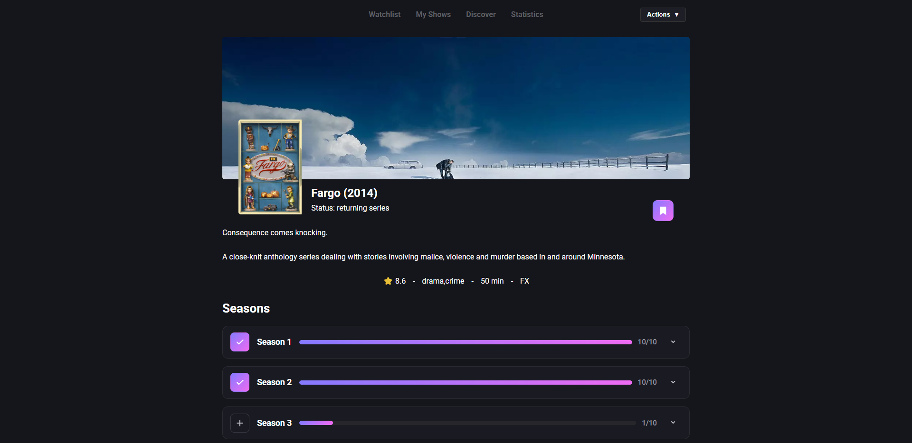
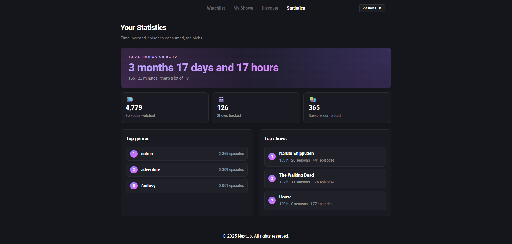

# NextUp - Smart Show Tracker

<p align="center">
  
  
</p>

## Project Description

NextUp is a modern **TV show tracker** built with Vanilla JavaScript and Supabase. Track your watched episodes, organize shows into **multiple lists**, explore new series, and review detailed statistics — all in a **single-page application**. Optionally link your **Trakt.tv** account to import progress, and install the **PWA** to get **push notifications** when new episodes are detected.

## Features

### Watching & lists

- **Home watchlist** — Active (in-progress) shows from your selected list, with **list filter** dropdown, **sorting** (last added, title, year, rating, last watched, episodes left), and asc/desc order (saved in `localStorage`). Cards show next-episode overview, progress pill, and “X left” badge.
- **Multiple lists** — Create, rename, and delete lists on Profile; filter Home and My Shows by list; use the **⋮ menu** on collection cards to add or remove a show on other lists.
- **My Shows** — **Upcoming episodes** grid with countdown; **full collection** with text search, sort, **hype filter**, genre chips, and **list selector**.
- **Show page** — Seasons/episodes, mark watch progress, **Hype meter** (your 5-tier personal rating), per-show notes, related shows from Trakt, collection toggle across lists.
- **Discover** — Search with pagination, recent searches, Trending / Popular / Most Anticipated carousels.

### Statistics & social

- **Statistics dashboard** — Hero watch time, overview tiles, charts (activity, genres, networks); **Your hype** section for personal ratings; main view uses your **default collection**.
- **Your lists (stats)** — Per-list insight cards for every list you own (cached in Supabase for speed).
- **Follow users** — Follow friends by email on Profile and open their public stats page.

### Account & sync

- **Profile** — Lists, themes, notes, Trakt connect/sync, **Web Push** toggles, following, refresh, logout.
- **Themes** — Midnight, Ocean, Ember, Forest (Profile picker).
- **Trakt.tv sync** — OAuth import of shows and watch history; manual “Sync New Episodes”.
- **Daily episode sync** — Scheduled function (6 AM UTC) updates the database; can send **push notifications** to subscribed devices.

### App experience

- **PWA** — Install to home screen; service worker with **push** + notification click → open show.
- **Responsive navbar** — Hamburger on mobile; auto-hide on scroll; back button for in-app history.
- **Episode modal** — Desktop dialog / mobile bottom sheet; unaired episodes cannot be marked watched.
- **Secure auth** — Supabase Auth + RLS; Trakt tokens server-side with auto-refresh.

## Tech Stack

- **Frontend**: HTML5, CSS3, Vanilla JavaScript (ES6 modules), hash SPA, responsive + safe-area for PWAs
- **Backend**: Netlify Functions, Supabase (PostgreSQL + Auth + RLS)
- **APIs**: Trakt.tv; Web Push (VAPID via `web-push`)
- **Deployment**: Netlify

  [](https://skillicons.dev)

## Project Architecture

```
NextUp/
├── index.html, login.html
├── manifest.webmanifest          # PWA manifest
├── sw.js                         # Service worker (fetch, push, notificationclick)
├── netlify.toml
├── package.json
├── .env                          # Not committed — see SUPABASE_SETUP.md
│
├── css/style.css
├── components/                   # header.html, footer.html
├── db/migration.sql              # Full schema + incremental v2.8 blocks at end
│
├── src/
│   ├── app.js                    # Boot, router, push resync on login
│   ├── login.js
│   ├── api/                      # shows, episodes, watchlist, lists, ratings, stats, push, sync, notes, social
│   ├── ui/                       # watchlist, myShows, listFilter, statistics, profile, discover, …
│   ├── pages/                    # home, show, discover, myShows, stats, profile, userStats
│   ├── stores/                   # user, watchlist, myShows, lists, discover, stats, …
│   ├── services/                 # auth, supabase, theme, libraryCache, pageCache, navHistory
│   ├── pwa/                      # registerServiceWorker, pushNotifications
│   └── utils/                    # format, icons, stats, multiListStats
│
└── netlify/
    ├── lib/                      # supabase.js, trakt.js, webPush.js
    └── functions/                # Trakt, sync, push, followUser, getPublicUserStats, …
```

### How the layers connect

```
Browser → app.js (router) → pages → api (Supabase direct or Netlify Functions) → ui + stores
Scheduled syncNextEpisodes → Trakt → Supabase → optional Web Push to push_subscriptions
```

See [Architecture](docs/ARCHITECTURE.md) for data flows, security, and push pipeline.

## Quick Start

1. **Clone**

   ```bash
   git clone git@github.com:AntonioSertic23/NextUp.git
   cd NextUp
   ```

2. **Supabase** — Follow [SUPABASE_SETUP.md](SUPABASE_SETUP.md): run `db/migration.sql` (full file for new projects; for upgrades, run new sections at the bottom of the file).

3. **Environment** — Create `.env` in the project root:

   ```sh
   TRAKT_CLIENT_ID="your_trakt_client_id"
   TRAKT_CLIENT_SECRET="your_trakt_client_secret"
   SUPABASE_URL="https://your-project.supabase.co"
   SUPABASE_ANON_KEY="your_anon_key"
   SUPABASE_SERVICE_ROLE_KEY="your_service_role_key"
   ```

   Optional:

   - `TRAKT_REDIRECT_URI` — e.g. `http://localhost:8888` for `netlify dev` (must match Trakt app Redirect URI)
   - **Web Push** (2.8+): `VAPID_PUBLIC_KEY`, `VAPID_PRIVATE_KEY`, optional `VAPID_SUBJECT` (`mailto:you@example.com`). Generate with `npx web-push generate-vapid-keys`.

4. **Install & run**

   ```bash
   npm install
   npm install -g netlify-cli
   netlify dev
   ```

5. **Open** the localhost URL. For PWA install and push, use your **HTTPS** Netlify deploy.

## Usage Overview

| Area | What you can do |
|------|-----------------|
| **Home** | Active shows on selected list; sort; open episode modal or show page |
| **My Shows** | Upcoming air dates; browse collection by list, genre, search |
| **Discover** | Search; trending/popular/anticipated; add shows from show page |
| **Statistics** | Default-list overview; scroll to **Your lists** for per-list cards |
| **Profile** | Lists, themes, notes, Trakt, push notifications, follow users, sync episodes |
| **PWA** | Install app; enable notifications (iOS: add to Home Screen first) |

## Documentation

| Document | Contents |
|----------|----------|
| [API](docs/API.md) | Netlify Functions, push endpoints, auth |
| [Database](docs/DATABASE.md) | Tables (lists, notes, cache, push), RLS, migrations |
| [Architecture](docs/ARCHITECTURE.md) | Flows, push pipeline, module graph |
| [Deployment](docs/DEPLOYMENT.md) | Env vars (incl. VAPID), Netlify, checklist |
| [Developer Guide](docs/CONTRIBUTING.md) | Local setup, conventions, testing |
| [User Guide](docs/USER_GUIDE.md) | End-user help for 2.8 features |
| [Changelog](docs/CHANGELOG.md) | Version history (**2.8.0** latest) |
| [Supabase Setup](SUPABASE_SETUP.md) | Database + env quick reference |

## Security & Privacy

- **Supabase Auth** for login; passwords only in `auth.users`.
- **RLS** isolates user data (lists, progress, notes, push subscriptions, stats cache).
- **Trakt tokens** stored server-side; refresh handled by Netlify functions.
- **Push**: private VAPID key only on server; subscriptions tied to your user id; stale endpoints removed on delivery failure.
- Trakt sync and push are **opt-in** (connect Trakt / enable notifications on Profile).

## Author

**Antonio Sertić**

## License

MIT License
